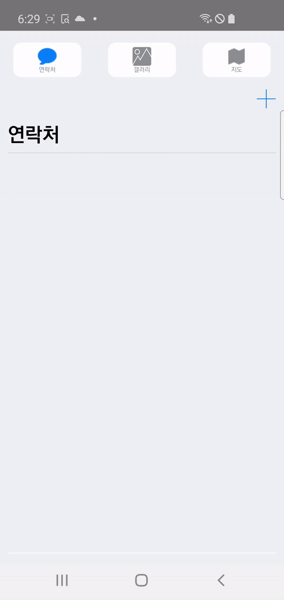

몰입캠프 (Week1)
======================

# 1. Introduction
## Project : 카이스트 안내 백서
* period: 2021.12.28 ~ 2022.01.04
Team: [Seohyeon Kim](https://github.com/seohyeon0322), [Seongho Jin](https://github.com/SeonghoJin)

    
    
     

# 2. Project Description 
## **Loading Activity**
- Loading Activity 에서 모든 권한을 요청합니다. 
- 요청하는 권한들은 외부 저장소 작성, 카메라, 전화, 위치 정보 액세스 권한입니다.
 ---
## **Tab1: Phone (RecyclerView)**

## Features
1. 연락처 추가
2. 연락처 삭제
3. 전화

### Feature 1. 연락처 추가
- 연락처 추가를 위해 이름을 적을 때 프로필 이미지가 변경되도록 구현했습니다.
- 연락처 추가를 할때 아무것도 입력되지 않을 경우 추가 버튼이 눌리지 않고, 회색 색깔이 되도록 구현했습니다. 
전화 번호 정보를 저장하기 위해 "룸 데이터베이스"를, 정보를 효과적으로 보여주기 위해 리사이클러뷰를 사용했습니다.
우측 상단에 있는 추가 십자가 아이콘을 클릭하여 전화번호를 추가할 수 있습니다. '+'아이콘을 클릭하면 밑에서 사용자 정보를 입력할 수 있는 
Dialog가 나타납니다. 썸네일은 사용자가 이름을 입력할 때 변경됩니다. 전화번호를 추가한 후 번호를 누르면 전화하거나 삭제할 수 있습니다.
### Feature 2. 연락처 삭제
- library를 이용하여 연락처 리스트 중 삭제하고 싶은 연락처를 스와이프 하면 삭제와 전화 버튼이 나타나도록 구현했습니다. 이때, 삭제 버튼을 누르면 연락처가 삭제됩니다.
- 이 버튼을 누르면 데이터베이스에서 연락처를 삭제하여 앱을 껐다 켰을 때에도 적용될 수 있도록 합니다.
### Feature 3. 전화 
- 연락처를 스와이프하면 전화 버튼이 나타나고, 이 버튼을 누르면 전화를 할 수 있습니다. 

## Layout
- 전화와 연락처 삭제의 레이아웃은 swipelayout 라이브러리를 이용하여 구현했습니다.
- 연락처를 생성하는 Fragment는 Material 라이브러리의 Bottom Sheet Dialog를 사용하여 구현했습니다.
- Bottom Sheet Dialog에서 완료버튼을 누를시 PhoneCreateCallback 이라는 Functional Interface 타입인 콜백 함수를 실행합니다.
```java

/** 
 *  Functional Interface  
 * **/
package com.example.myapplication.phone;

@FunctionalInterface
public interface PhoneCreateCallback {
    void start(String number, String lastName, String firstName);
}
```

## Test Video
<p align="center"></p>

---

## **Tab2: Gallery (GridView)**
## Features
1. 폴더 생성 및 삭제
2. 이미지 추가 및 삭제
3. 이미지 정보

### Feature 1. 폴더 생성 및 삭제
* 우측 상단의 '+'표시를 클릭하여 앨범을 생성합니다.
* 앨범이 생성된 경우 앨범 썸네일을 롱 클릭하여 앨범을 삭제할 수 있습니다.
~~~java
@Entity
public class GalleryFolder {

    @PrimaryKey
    public int id;

    @ColumnInfo(name = "folder_name")
    public String folderName;

    @ColumnInfo(name = "images")
    public ArrayList<String> images;
}
~~~
* 위 사진은 GalleryFolder Entity를 보여줍니다. 폴더를 생성하는 경우에 id, folderName, images(이미지 경로)를 포함합니다. 폴더를 생성, 삭제하는 경우에 데이터베이스에서 galleryFolder Entity를 추가, 삭제합니다.

~~~java
@Dao
public interface GalleryDao {
    @Insert
    public void insertFolder(GalleryFolder galleryFolder);

    @Update
    public void updateFolders(GalleryFolder galleryFolder);

    @Delete
    public void deleteFolder(GalleryFolder galleryFolder);

    @Query("SELECT * FROM galleryFolder")
    public List<GalleryFolder> loadAllFolders();

    @Query("SELECT * FROM galleryfolder WHERE id = :key")
    public GalleryFolder getGalleryFolderbyKey(int key);

    @Query("DELETE FROM galleryFolder")
    public void deleteall();
}
~~~
위 코드는 데이터베이스에 접근하는 object입니다. insertFolder와 deleteFolder를 이용하여 Entity를 추가, 삭제합니다.

### Feature 2. 이미지 추가 및 삭제
* 앨범을 롱클릭하거나, 앨범 내부에 들어가서 사진을 추가할 수 있습니다.
    * 앨범 썸네일을 롱클릭하여, '앨범에 이미지 추가'를 선택하면 사진을 촬영하여 이미지를 추가할 수 있습니다.
    * 우측 상단의 '+' 표시를 클릭하면 사진을 촬영하여 이미지를 추가할 수 있습니다.
* 앨범 내부, 이미지 확대 화면에서 이미지를 삭제할 수 있습니다.
    * 앨범 내부에서 삭제하고 싶은 이미지를 롱클릭하여 '사진 삭제'를 클릭하면 이미지를 삭제할 수 있습니다. 
    * 앨범을 클릭하여을 삭제할 경우, 좌측 하단에 있는 아이콘을 클릭하면 이미지를 삭제할 수 있습니다.
* 이미지를 추가, 삭제하는 경우 'updateFolders'를 이용하여 데이터베이스를 갱신합니다.
### Feature 3. 이미지 정보
* 앨범 내부에서 사진을 클릭한 후, 우측 하단에 있는 아이콘을 클릭하면 이미지의 폴더 정보를 확인할 수 있습니다.

## Layout
* gallery tab을 하나의 fragment로 구현했습니다. 앨범 썸네일을 클릭할 경우 gridView를 적용한 새로운 activity로 이동하게 되며, 앨범 내에서 사진을 선택하는 경우 galleryView를 적용한 새로운 activity로 이동하게 됩니다.
* activity로 이동하는 경우 Intent를 통하여 정보를 전달해줍니다. 새로운 activity에서 돌아오는 경우에는 onResume()함수에서 변경사항을 적용하여 activity로 돌아왔을 때, 데이터를 update해줄 수 있도록 구현했습니다.
* 클릭시 나타나는 창의 경우에는 Dialog를 이용하여 구현했습니다.


## Test Video
<p align="center"></p>


룸 데이터베이스를 통해서 갤러리의 폴더와 이미지 정보들을 저장했습니다. 앱 내에서 폴더를 생성하는 경우 데이터베이스에 해당 폴더 데이터를 추가합니다. 이 데이터에는 폴더 이름과 폴더의 이미지 경로 arraylist가 포함됩니다. 사진을 찍으면 arraylist에 이미지 경로가 추가되며, 이 사진이 갤러리에 포함됩니다. 


 
---
## **Tab3: Map**
We used "googlemap API" to show the map.
* When the user click the marker, blur fragment appears. The blur fragment contains the information 

## Features
1. 카이스트 캠퍼스 맵
2. 카이스트 캠퍼스 소개

### Feature 1. 카이스트 캠퍼스 맵
* 세번째 탭을 클릭하면, 카이스트의 캠퍼스 맵이 로드됩니다.
* 지도에 있는 마커를 클릭하면 해당 건물의 정보를 확인할 수 있습니다. 

### Feature 2. 카이스트 캠퍼스 소개
* 지도에 있는 마커를 클릭하면 해당 건물의 정보를 확인할 수 있습니다.
* 건물의 내부 모습과, 건물에 대한 간략한 소개를 확인할 수 있습니다. 
* 화살표를 클릭하면, 각 정보를 볼 수 있습니다.

## Layout

## Test Video
<p align="center"></p>


# Design Reference


## loading image
<p align="center"></p>

from  instagram @kaist_hobby

# Libraries

- [com.google.android.material:material:1.4.0](https://github.com/material-components/material-components-android/releases)
  - bottom sheet dialog를 구현하기 위해 사용했습니다.
- [com.google.android.gms:play-services-maps:18.0.0](https://developers.google.com/android/guides/setup)
- [com.google.android.gms:play-services-location:18.0.0](https://developers.google.com/android/guides/setup)
  - 위 2개의 라이브러리는 지도 맵 구현을 위해 사용했습니다.
- [com.google.code.gson:gson:2.8.9](https://github.com/google/gson)
  - 배열로된 데이터를 저장하기 위해 사용했습니다.
- [androidx.room:room-runtime:2.4.0-alpha03](https://developer.android.com/jetpack/androidx/releases/room?hl=ko)
  - Room database를 적용하기 위해 사용했습니다. 
- [androidx.cardview:cardview:1.0.0](https://developer.android.com/jetpack/androidx/releases/cardview?hl=ko)
  - CardView를 구현하기 위해 사용했습니다.
- [com.chauthai.swipereveallayout:swipe-reveal-layout:1.4.1](https://github.com/chthai64/SwipeRevealLayout)
  - 탭 1에서 각 item을 스와이프 하는 UI를 구현하기 위해 사용했습니다.
- [com.eightbitlab:blurview:1.6.6](https://github.com/Dimezis/BlurView)
  - google map marker를 클릭했을 때 blur fragment를 띄우기 위해서 사용했습니다.
- [com.github.chrisbanes:PhotoView:2.1.4](https://github.com/Baseflow/PhotoView)
  - 사진의 크기 및 조절을 구현하기 위해 사용했습니다.
- [com.github.skydoves:expandablelayout:1.0.7](https://github.com/skydoves/ExpandableLayout)
  - 아코디언 UI를 구현하기 위해 사용했습니다. 

